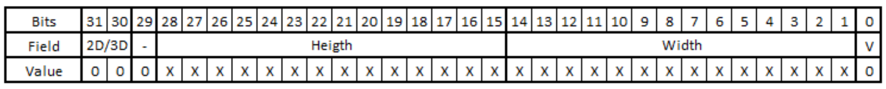
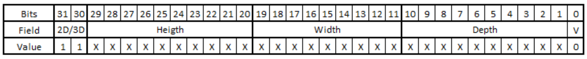

# Challenge: Array management and bitwise operations

    :warning: ATTENTION! The following scenario is completely fictional and
    doesn’t match with the way pixels are managed in real life. Use it only as
    a practice exercise.

## Description

FullHD images are formatted 1920 x 1080. One single FullHD image has over 2
million pixels. Pixel dimensions can be stored in unsigned 32-bit integers by
assigning values to different bits. For instance, in a 2D image each pixel has
height and width values while a 3D image has the same plus a depth value.

The representation of this data in a 32-bit field is shown in below images.


*Image 1. 2D Pixel Representation on 32-bit*


*Image 2: 3D Pixel Representation on 32-bit*

You will need to create a function `PixelData()` that will receive four (4)
input parameters. Three (3) parameters will be a pointer to an array of
integers that will represent the dimensions of a pixel. Fourth parameter will
be number of elements in the array (“N”). This way, `PixelN` location will be
defined by `height[N]`, `width[N]` and `depth[N]`. Your function will return an
array of 32-bit elements sorted accordingly to the following Software
Requirements.

## Software Requirements Specifications

* **SRS-001.** Pixel depth should always be greater than 0. Pixels with 0 depth
  shall be invalidated.

* **SRS-002.** Invalid pixels shall have all fields set to 0 and bit0 set
  to 1.

* **SRS-003.** Valid pixels shall have bit0 set to 0.

* **SRS-004.** All valid 2D pixels will have depth equals to 1 and the 32-bit
  representation of the pixel shall follow rules defined in Image 1.

* **SRS-005.** All valid 3D pixels will have depth greater than 1 and the
  32-bit representation of the pixel shall follow rules defined in Image 2.

* **SRS-006.** Pixel’s height, width and depth will be given in 32-bit values
  but only the number of bits defined by Image 1 and Image2 of these values
  should be used. Other bits should be considered trash.

* **SRS-007.** PixelData function shall return a pointer to an UINT32_T array.

* **SRS-008.** PixelData function returned array shall contain all N pixel data
  received in as parameters coded in 32-bit elements.

* **SRS-009.** Returned array shall be sorted by height as 1st priority. This
  mean the pixel at the lowest height shall be at index [0] of the returned
  array.

* **SRS-010.** Returned array shall be sorted by width as 2nd priority. This
  means in case two pixels share the same height, the pixel with the lower
  width shall be at the lower index of the returned array.

* **SRS-011.** All invalid pixels shall be inserted at the beginning of the
  returning array.

## Assumptions

You will receive a main function that will make a call to your `PixelData`
function with input parameters for you to validate the execution your code.
See code below as an example.

## Examples

    :information_source: This will NOT be the only test case we will use to
    validate correctness and execution time of your code. Consider corner
    cases.

A 3D pixel with `height: 5`, `width: 10` and `depth: 2`, should be converted
into an unsigned 32-bit integer equal to `0xC0505004`.

### Sample Code

```c
int main() {
    uint32_t *ptrPixelHeight = getAllPixelHeight();
    uint32_t *ptrPixelWidth = getAllPixelWidth();
    uint32_t *ptrPixelDepth = getAllPixelDepth();
    uint32_t *ptrAllPixelData = PixelData(ptrPixelHeight, ptrPixelWidth, ptrPixelDepth);
    return 0;
}

uint32_t * PixelData(
    uint32_t *ptrHeight,
    uint32_t *ptrWidth,
    uint32_t *ptrDepth,
    uint32_t array_size
) {
    // Insert your code here
}
```

## Acceptance Criteria

1. Solution must be written in C language
2. Solution must follow conventional coding standards
    a. Proper indentation
    b. Well commented

---

*Keywords: Shift operations, Bitwise operations, Bit Field structs, Pointers.*
